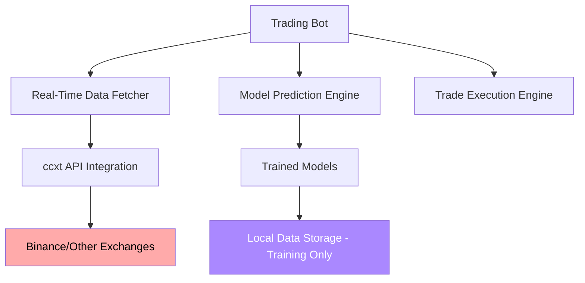

# Real-Time Data Architecture for Trading Bot

## Overview

This document outlines the architecture for implementing real-time market data fetching using ccxt while maintaining the local data folder exclusively for training purposes.

## Current Issues

1. The trading bot currently uses local database files instead of real-time market data
2. Data loading mechanism needs to be separated between live trading and training
3. Real-time data fetching needs to be implemented with proper error handling

## Proposed Architecture



## Data Flow

1. **Live Trading Data Flow**:
   - Trading bot requests latest market data
   - Real-time data fetcher uses ccxt to get data from exchanges
   - Data is validated and processed
   - Features are generated using existing feature engineering pipeline
   - Models make predictions based on real-time data
   - Trades are executed based on predictions

2. **Training Data Flow**:
   - Data collection scripts fetch historical data from exchanges
   - Data is stored in local SQLite databases
   - Training pipeline loads data from local databases
   - Models are trained on historical data
   - Trained models are saved for live trading

## Implementation Plan

### 1. Remove Local Database Loading

Remove the `_load_symbol_data` method and related functionality from `PaperTrader` class that loads data from local databases.

### 2. Implement ccxt-based Data Fetching

Create a new data fetching implementation using ccxt library:

```python
async def get_market_data_ccxt(self) -> dict:
    """Get latest market data for all symbols using ccxt."""
    market_data = {}
    
    # Initialize exchange connection
    exchange = ccxt.binance({
        'enableRateLimit': True,
        'options': {
            'defaultType': 'spot'
        }
    })
    
    for symbol in self.symbols:
        try:
            # Fetch OHLCV data
            ohlcv = await exchange.fetch_ohlcv(symbol, '15m', limit=100)
            
            # Convert to DataFrame
            df = pd.DataFrame(ohlcv, columns=['timestamp', 'open', 'high', 'low', 'close', 'volume'])
            df['datetime'] = pd.to_datetime(df['timestamp'], unit='ms')
            df = df.set_index('datetime')
            
            # Add missing columns with default values
            df['quote_volume'] = df['volume']
            df['trades'] = 0
            df['taker_buy_base'] = 0
            df['taker_buy_quote'] = 0
            
            # Generate features
            features_df = self.feature_engine.generate_all_features(df)
            market_data[symbol] = features_df
            
            # Update last price
            self.last_prices[symbol] = df['close'].iloc[-1]
            
        except Exception as e:
            self.logger.logger.error(f"Error fetching data for {symbol}: {e}")
            continue
    
    return market_data
```

### 3. Data Validation and Quality Checks

Implement comprehensive data validation:

- Check for missing values
- Validate OHLC relationships
- Ensure data freshness
- Handle API rate limits
- Implement retry mechanisms

### 4. Error Handling

Implement robust error handling for:

- Network connectivity issues
- API rate limiting
- Invalid data responses
- Exchange maintenance windows
- Data quality issues

## Separation of Concerns

### Live Trading (Real-Time Data)
- Uses ccxt to fetch live market data
- Data is not stored locally
- Features are generated on-the-fly
- Models make predictions using real-time data

### Training and Backtesting
- Uses local SQLite databases
- Data is collected separately by data collection scripts
- Historical data is used for training
- Backtesting uses local data for simulation

## Configuration

Update configuration to support both modes:

```yaml
data:
  symbols: ["BTCEUR", "SOLEUR", "ADAEUR", "XRPEUR", "ETHEUR"]
  interval: "15m"
  data_dir: "./data"  # For training only
  live_trading: true  # Enable real-time data fetching

api:
  exchanges:
    - name: "binance"
      rate_limit: 1000
      timeout: 30
```

## Testing Strategy

1. **Unit Tests**:
   - Test ccxt data fetching implementation
   - Test data validation functions
   - Test error handling scenarios

2. **Integration Tests**:
   - Test end-to-end data flow
   - Test feature generation with real-time data
   - Test model predictions with real-time data

3. **Live Testing**:
   - Test with paper trading mode
   - Monitor data quality and API usage
   - Verify trade execution based on real-time signals

## Rollback Plan

If issues occur with real-time data implementation:

1. Revert to local database loading (previous implementation)
2. Use cached data for testing
3. Implement fallback mechanisms
4. Monitor logs for error patterns

## Performance Considerations

1. **API Rate Limiting**:
   - Implement proper rate limiting
   - Use connection pooling
   - Cache data when appropriate

2. **Data Processing**:
   - Optimize feature generation
   - Use efficient data structures
   - Minimize memory usage

3. **Error Recovery**:
   - Implement circuit breaker pattern
   - Use exponential backoff for retries
   - Log all errors for analysis

## Security Considerations

1. **API Keys**:
   - Use environment variables for API keys
   - Implement key rotation
   - Limit permissions to read-only where possible

2. **Data Privacy**:
   - Ensure no sensitive data is logged
   - Implement data encryption for local storage
   - Follow exchange API guidelines

## Monitoring and Logging

1. **Data Quality Metrics**:
   - Track data freshness
   - Monitor missing values
   - Log API response times

2. **Error Tracking**:
   - Log all API errors
   - Track error patterns
   - Implement alerting for critical errors

3. **Performance Metrics**:
   - Track data fetching latency
   - Monitor feature generation time
   - Log model prediction performance

## Future Enhancements

1. **Multiple Exchange Support**:
   - Add support for other exchanges
   - Implement exchange selection logic
   - Handle exchange-specific data formats

2. **Advanced Data Processing**:
   - Implement data smoothing
   - Add outlier detection
   - Implement data interpolation

3. **Caching Strategy**:
   - Implement intelligent caching
   - Add cache invalidation
   - Optimize cache storage

This architecture ensures a clean separation between live trading data (real-time) and training data (local storage) while maintaining the robustness and reliability of the trading system.