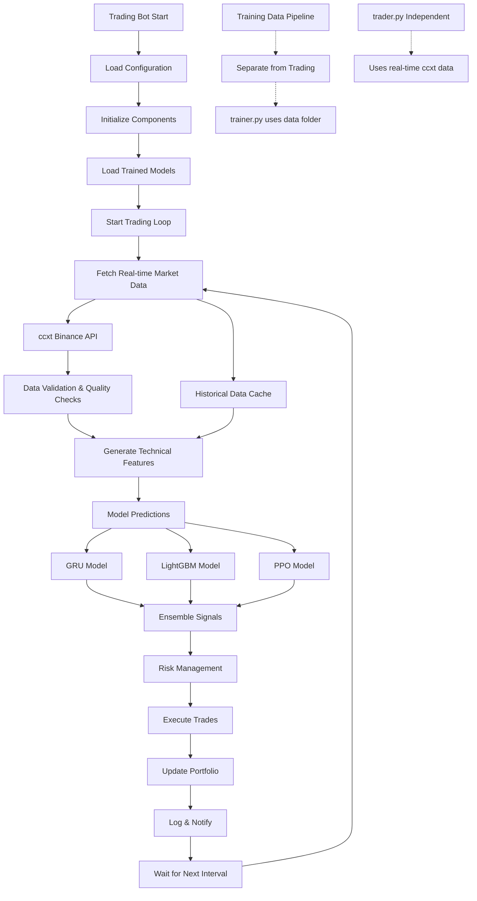

# Trading Bot Architecture Plan

## Current Issues Identified

1. **Critical Async/Sync Mismatch**: Line 655 calls `await self.get_market_data()` but `get_market_data()` is not async
2. **Symbol Format Conversion**: Only handles EUR pairs, needs to support all configured symbols
3. **Data Pipeline Dependency**: Currently depends on training data folder, should be independent
4. **Model Loading Issues**: File path patterns may not match actual model files
5. **Mixed Async/Sync Patterns**: Inconsistent use of async/await throughout the code

## Architecture Overview

## Key Architecture Changes

### 1. Complete Data Pipeline Separation
- `trader.py` fetches its own real-time data via ccxt
- No dependency on the `data/` folder used by `trainer.py`
- Independent historical data cache for feature engineering

### 2. Async/Sync Pattern Fix
- Either make `get_market_data()` async or remove `await` from line 655
- Consistent async pattern throughout the trading loop

### 3. Symbol Format Handling
- Current logic only converts EUR pairs (BTCEUR → BTC/EUR)
- Need to handle all configured symbols properly

### 4. Real-time Data Flow
- Fetch sufficient historical data for feature engineering (100+ candles)
- Generate features on real-time data
- Make predictions with trained models
- Execute trades based on signals

## Implementation Priority

1. **High Priority**: Fix async/sync mismatch (critical error)
2. **High Priority**: Implement proper symbol format conversion
3. **Medium Priority**: Create independent data fetching
4. **Medium Priority**: Fix model loading paths
5. **Low Priority**: Add caching and optimization features