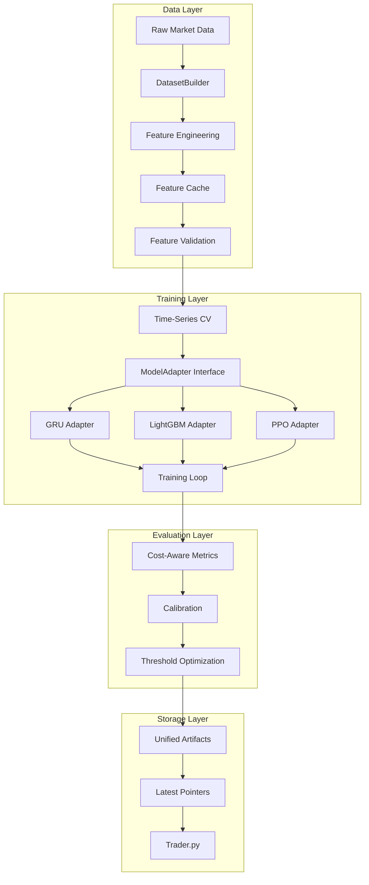

# Trainer.py Improvement Implementation Plan

## Overview
This plan implements the high-impact, low-friction improvements to scripts/trainer.py to achieve better, more reliable training results while maintaining simplicity.

## Architecture Diagram



## Implementation Details

### 1. DatasetBuilder Class
**Purpose**: Centralize dataset assembly to ensure consistency across all models.

**Key Features**:
- Single source of truth for data loading and feature engineering
- Deterministic column ordering
- Unified label definition (classification/regression)
- Returns standardized tuple: (X, y, timestamps, feature_names, meta)

**Location**: `src/data_pipeline/dataset_builder.py`

### 2. Feature Caching System
**Purpose**: Massive speed-up by avoiding redundant feature computation.

**Key Features**:
- Cache features as parquet files: `data/features/{symbol}_{interval}_{hash}.parquet`
- Feature signature hash based on feature names + parameters
- Automatic cache invalidation when features change
- Compression for efficient storage

**Location**: Integrated into DatasetBuilder

### 3. Feature Metadata Validation
**Purpose**: Prevent training/inference mismatches.

**Key Features**:
- Save metadata JSON alongside cached features
- Include: feature_names (ordered), dtypes, null counts, min/max, signature
- Validate metadata before training
- Fail fast on mismatches

**Location**: `data/features/{symbol}_{interval}_{hash}_metadata.json`

### 4. Time-Series Cross-Validation
**Purpose**: Realistic validation without data leakage.

**Key Features**:
- Purged K-Fold with configurable embargo period
- Single implementation used by all models
- Prevents look-ahead bias
- Returns consistent fold indices

**Location**: `src/utils/cross_validation.py`

### 5. Cost-Aware Metrics
**Purpose**: Optimize for net performance after trading costs.

**Key Features**:
- Configurable fee_bps and slippage_bps
- Calculate net Sharpe/Sortino ratios
- Decision threshold optimization for classifiers
- Track trade count and turnover

**Location**: `src/utils/metrics.py`

### 6. ModelAdapter Interface
**Purpose**: Uniform interface for all models while keeping trainer.py simple.

**Key Features**:
- Abstract base class with fit(), predict(), get_artifacts()
- Thin wrappers for existing trainers
- Consistent error handling
- Standardized logging

**Location**: `src/models/base_adapter.py`

### 7. Probability Calibration
**Purpose**: Better thresholding and more stable predictions.

**Key Features**:
- Isotonic or Platt scaling
- Fit on validation set per fold
- Persist calibration parameters
- Apply before threshold optimization

**Location**: Integrated into classification adapters

### 8. Parallel Training
**Purpose**: Speed up multi-symbol training.

**Key Features**:
- Multiprocessing pool with configurable max_workers
- Per-process random seeds
- Progress tracking
- Error isolation per symbol

**Location**: Enhanced main() function in trainer.py

### 9. Unified Artifact Layout
**Purpose**: Reliable model consumption by trader.py.

**Structure**:
```
models/
├── {model_type}/
│   └── {symbol}/
│       ├── {run_id}/
│       │   ├── model.bin
│       │   ├── calibrator.json
│       │   ├── metrics.json
│       │   ├── features.json
│       │   └── config_snapshot.json
│       └── latest -> {run_id}/
```

### 10. CLI Enhancements
**New Flags**:
- `--symbols`: Comma-separated list of symbols
- `--models`: Comma-separated list of models
- `--n-splits`: Number of CV splits (default: 5)
- `--embargo`: Embargo periods for CV (default: 100)
- `--fee-bps`: Trading fee in basis points (default: 10)
- `--slippage-bps`: Slippage in basis points (default: 5)
- `--cache`: Enable/disable feature cache (default: on)
- `--max-workers`: Max parallel workers (default: 4)
- `--seed`: Random seed (default: 42)

## Implementation Order

### Phase 1: Foundation (Commits 1-3)
1. **DatasetBuilder + Feature Cache**: Core data infrastructure
2. **Time-Series CV**: Validation framework
3. **Cost-Aware Metrics**: Evaluation utilities

### Phase 2: Model Integration (Commits 4-5)
4. **ModelAdapter Interface**: Unified model handling
5. **Calibration**: Probability calibration for classifiers

### Phase 3: Optimization (Commits 6-7)
6. **Parallel Training**: Multi-symbol parallelization
7. **Artifact Management**: Unified storage and CLI

## Testing Strategy

### Unit Tests
- DatasetBuilder consistency
- Feature cache invalidation
- CV fold generation
- Metric calculations
- Calibration accuracy

### Integration Tests
- End-to-end training flow
- Multi-symbol parallel training
- Artifact persistence and loading
- Cache performance

### Validation Tests
- Compare results with/without improvements
- Verify no data leakage
- Check calibration effectiveness
- Measure performance gains

## Success Metrics
- 50%+ reduction in training time via caching
- Zero feature mismatches between training/inference
- Improved net Sharpe ratios with cost-aware optimization
- Consistent cross-validation across all models
- Simplified trader.py integration